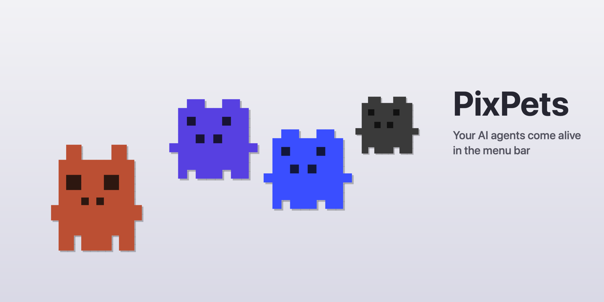

<p align="center">
  
</p>

<p align="center">
  <a href="https://www.apple.com/macos/"></a>
  <a href="https://swift.org"></a>
  <a href="LICENSE"></a>
</p>

## Install

### Homebrew (recommended)

```bash
brew tap Evgenii-Konev/tap
brew install --cask pixpets
```

Hooks for Claude Code, Codex, and other agents are installed automatically on first launch.

### Update

```bash
brew upgrade --cask pixpets
```

If `brew upgrade` says "already installed", pull the latest tap first:

```bash
brew update
brew upgrade --cask pixpets
```

### Manual

Download the latest `.dmg` from [Releases](https://github.com/Evgenii-Konev/pixpets/releases) and drag to Applications.

### Uninstall

```bash
brew uninstall --cask pixpets
```

## How it works

PixPets uses a push-based architecture:

1. A Claude Code hook fires on tool use events (`PreToolUse`, `PostToolUse`, `Stop`)
2. The hook writes a session JSON file to `~/.pixpets/sessions/`
3. An FSEvents watcher detects the change instantly
4. The menu bar icon updates — badge count shows active sessions, popover lists each agent with its status

Each agent gets its own pixel character with idle, blink, and walk animations — all drawn programmatically, no image assets.

## Supported agents

| Agent | | Color |
|-------|---|-------|
| Claude Code |  | Terracotta `#C96442` |
| Codex |  | Purple `#6B5CE7` |
| Cursor CLI |  | Blue `#4B6BFF` |
| OpenCode |  | Gray `#4A4A4A` |

## Development

```bash
swift build        # debug build
swift run          # build + run
swift build -c release
```

### Distribution

Requires `DEVELOPMENT_TEAM` and `CODE_SIGN_IDENTITY` env vars for signing:

```bash
DEVELOPMENT_TEAM=... CODE_SIGN_IDENTITY=... make distribute
```

Skip notarization for local testing:

```bash
SKIP_NOTARIZE=1 DEVELOPMENT_TEAM=... CODE_SIGN_IDENTITY=... make distribute
```

## Architecture

```
Sources/
  main.swift              → App entry (no dock icon, menu bar only)
  AppDelegate.swift       → Creates MenuBarController + SessionManager
  SessionManager.swift    → Hybrid push/pull session detection
  MenuBarController.swift → NSStatusItem with popover, icon animation
  SessionsPopoverVC.swift → Scrollable list of sessions
  PixelCharacter.swift    → 18x18 pixel grids, bitmap renderer
  AgentType.swift         → Agent classification with colors
  Session.swift           → Data models
  TerminalFocuser.swift   → Click-to-focus terminal navigation
hooks/
  pixpets-hook.sh         → Claude Code hook, writes session JSON
```

## Contributing

Found a bug or have a feature idea? [Open an issue](https://github.com/Evgenii-Konev/pixpets/issues).

## License

[MIT](LICENSE) — Evgenii Konev
